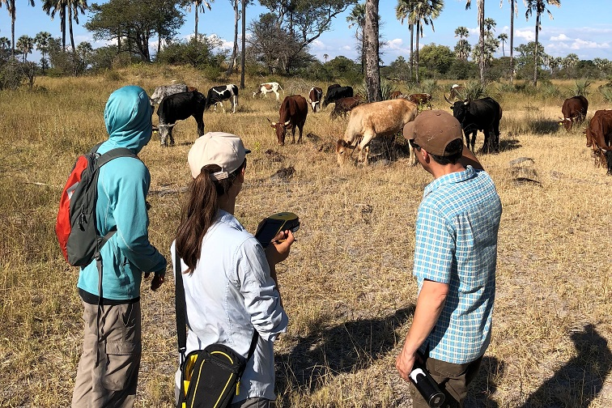

@title[geospatial technologies]
GIS and Geospatial Technologies 
-------------------------------
### @fa[globe fa-5x]
###### D.J. Biddle, GISP
###### Use the @fa[angle-down] and @fa[angle-right] arrows to navigate
---
@title[the plan]
#### the plan
- Everything happens..._________?
- What's in a GIS?
- Remote Sensing Basics
- Geography @ UofL
---
#### Complete the following statement...
> "Everything happens ..."
+++
> "Everything happens SOMEWHERE!"
+++
#### Geography is...
+++
#### Geography is...

> @size[.6em](Geography is the study of places and the relationships between people and their environments. Geographers explore both the physical properties of Earth’s surface and the human societies spread across it. They also examine how human culture interacts with the natural environment, and the way that locations and places can have an impact on people. Geography seeks to understand where things are found, why they are there, and how they develop and change over time. )
- [National Geographic Society](https://www.nationalgeographic.org/encyclopedia/geography/)
+++
#### The spatial perspective
- Geographers know that where things happen, and how the locations of different people, events, and natural phenomenon relate to each other is KEY in understanding the whole picture.
- Spatial analysis is the framework we use to answer geographic questions
- Geographic Information Systems (GIS) is the tool we use to do spatial analysis!
---
#### A Scenario!
- A dangerous chemical spills from a local factory, threatening the surrounding neighborhoods!
- The chemical spill will affect all residents within 1 mile of the factory
- But! Because the chemical flows downhill, houses that are on higher ground are safe!
- Who do we need to evacuate? 
--- 
#### what is gis? 
> @size[.6em](A geographic information system <GIS> is a framework for gathering, managing, and analyzing data. Rooted in the science of geography, GIS integrates many types of data. It analyzes spatial location and organizes layers of information into visualizations using maps and 3D scenes. ​With this unique capability, GIS reveals deeper insights into data, such as patterns, relationships, and situations—helping users make smarter decisions.) 
###### -Environmental Research Systems Institute (ESRI)
+++
@title[gis components]

+++
@title[gis database concept]

+++
@title[gis layers concept]

+++
@title[gis applications]

+++
##### Our Scenario...
- A dangerous chemical spills from a local factory, threatening the surrounding neighborhoods!
- The chemical spill will affect all residents within 1 mile of the factory
- But! Because the chemical flows downhill, houses that are on higher ground are safe!
- Who do we need to evacuate?
+++
@transition[fade]

+++
@transition[fade]
- 1 mile buffer around site

+++
@transition[fade]
- select buildings with elevation < factory

+++
@transition[fade]
- select buildings with elevation > factory

+++
@transition[fade]
- query land record to identify landowners for call list

---
#### Common GIS Applications
##### Demographic Mapping/Social Sciences
- Where are vulnerable populations located?
- How do environmental hazards differential impact different social groups
- Environmental Justice? 
+++
@title[demographic mapping example]
[Demographic Mapper](http://www.ulcgis.org/flexviewers/KIPDA_Map)

+++
@title[environmental justice example]
https://ejscreen.epa.gov/mapper/

+++
##### Site Selection
- Where should a new business be located?
  - Where are the customers?
  - How far will they have to travel? 
  - Will they buy your product?
  - Where is the competition located?
+++
##### Example: Food Deserts
> [The Geospatial Revolution: Food Deserts](https://ket.pbslearningmedia.org/resource/psu10sci.vid.geospatial.fooddeserts/geospatial-revolution-food-deserts/?)
+++
##### Logistics/Transportation
- How can we minimize transportation costs?
- What is the best route for the UPS truck?
- Do we need a new TARC route due to population growth? 
+++
##### Example: UPS Logistics Operations
> [The Geospatial Revolution: Your Next Job](https://ket.pbslearningmedia.org/asset/psu10sci_int_geospatial_yournextjob/)
+++
##### journalism/storytelling
- Story Maps convey place-based narratives about a topic or idea
- Mashups of maps, text, and multimedia in an interactive web applications
- Effective and engaging communication in a web browser
- https://storymaps.esri.com

+++
@title[story map example 1]
<iframe class="stretch" data-src="https://centerforgis.maps.arcgis.com/apps/Cascade/index.html?appid=08c2849d3f1649758e40b8cfa67d0248"></iframe>
+++
@title[story map example 2]
<iframe class="stretch" data-src="https://centerforgis.maps.arcgis.com/apps/MapSeries/index.html?appid=e7fd5854dbab435b944c27913df01980"></iframe>
+++
@title[story map example 3]
<iframe class="stretch" data-src="https://centerforgis.maps.arcgis.com/apps/Cascade/index.html?appid=307e73fffa6f4206b9d356459998b607"></iframe>
+++
##### 1,000 Uses for GIS
There are literally thousands of ways to use GIS to answer questions, create new knowledge, and help people understand their world a little better!
https://gisgeography.com/gis-applications-uses/ 
---
@title[remote sensing basics]
#### remote sensing
> Remote sensing is the science and art of obtaining information about an object, area, or phenomenon through the analysis of data acquired by a device that is not in contact with the object, area, or phenomenon under investigation
- Lillesand et al., 2008
- What does that mean?? 
+++
@title[measurement from distance]
Hearing, seeing, smelling are all remote sensing, but here we focus on one kind: 
Measurement, by satellite-borne sensors (mostly), of the electromagnetic energy reflected or emitted from objects on the Earth’s surface.
+++
@title[measurement from distance]
Specifically, we will focus on observations of Earth’s land and water surfaces by means of reflected and emitted electromagnetic energy
+++
@title[measurement from distance]
Remote sensing is an applied science and is a tool to help understand other fields such as ecology, climatology, geology, soil science and hydrology
+++
@title[remote sensing platforms]

+++
@title[remote sensing platforms]

+++
@title[remote sensing platforms]

---
##### geography @ uofl
- Do you love computers? 
- Do you love graphics/art/design?
- Do you love video games/vr?
- Do you love nature/outdoors? 
+++
##### geography @ uofl
##### you would LOVE geography!
+++
##### You will learn...
- How to make maps
- How to fly drones
- How to analyze satellite imagery
- How to code computer programs
- How to build 3D models
+++
##### Degrees Offered
- B.S. in Applied Geography
  - Environmental Analysis
  - Geospatial Technologies
  - Human and Cultural Dynamics
  - Urban Analysis 
- Certificate in Geospatial Technologies
+++
### Projects you could be involved in!
+++
##### [WorldPop Population Modeling](http://www.worldpop.org.uk/)

+++
##### Urban Hydrology 

+++
##### UAS and Stream Ecology

+++
##### [Climate Change Science](http://louisville.edu/artsandsciences/news/all/Mountain)

+++
##### UAS Research in Africa

+++
##### [Chasing Tornados](http://louisville.edu/artsandsciences/news/all/storm-chasers-2018)

+++
##### [Urban Development/Social Justice](http://louisville.edu/artsandsciences/news/all/walker-and-hanchette)

+++
##### [Immigrant and Refugee Support](https://www.citylab.com/life/2017/03/the-tech-promising-to-help-immigrants-push-back-on-trump/519993/)

+++
##### For More Info
- On the web: https://www.louisville.edu/geogeo
- [Send us an email!](https://louisville.edu/geogeo/contact-us/email-the-department)
---
@title[helpful links]
##### Some useful links
- http://www.louisville.edu/geogeo
- https://www.esri.com
- https://www.arcgis.com
- https://storymaps.arcgis.com
- https://storymap.knightlab.com/ (Open Source Story Mapping)
- https://qgis.org/ (Open Source Desktop GIS)
+++
@title[questions?]
### Any questions? 
Please email me at <djbidd01@louisville.edu>

	

 